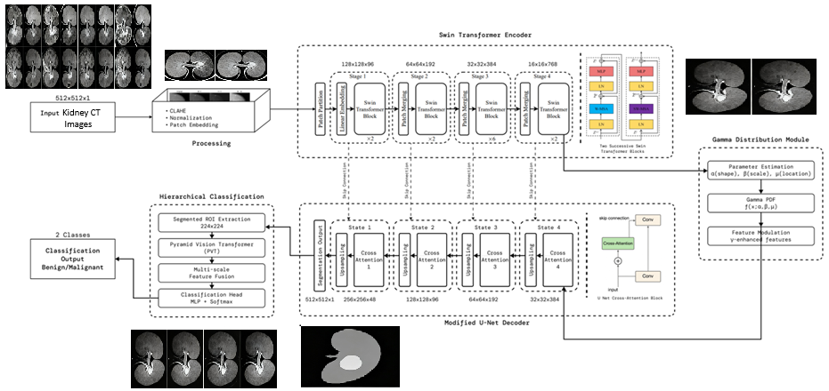

# GDT-SWINKID: A HYBRID MODEL FOR PRECISE RENAL LESION ANALYSIS

A modular implementation of **CAX-Net** adapted for **kidney CT image analysis**, integrating **Convolutional Vision Transformers (CvT)**, **Autoencoder-based Dimensionality Reduction**, and **XGBoost-based Multi-Class Classification**.

Target task: **Renal lesion classification — Normal, Cyst, Tumor, Stone**.

## Architecture



### **GDT-SwinKid Processing Pipeline**

1. **CvT (Convolutional Vision Transformer)**
   Extracts **768-dimensional deep embeddings** from kidney CT slices.

2. **Autoencoder (ADE)**
   Compresses features from **768 → 64 latent dimensions**, reducing redundancy and overfitting.

3. **XGBoost (Multi-class)**
   Performs classification across **4 renal categories**:

   * Normal
   * Cyst
   * Tumor
   * Stone

## Installation

### 1. Clone the Repository

```bash
git clone https://github.com/nakka-thirupathi/gdt-swinkid.git
cd gdt-swinkid
```

### 2. Create Virtual Environment

```bash
python -m venv .venv
.venv\Scripts\activate      # Windows
# or
source .venv/bin/activate   # Linux / Mac
```

### 3. Install Dependencies

```bash
pip install -r requirements.txt
```

### 4. Create Required Folders

```bash
mkdir -p models results checkpoints
```

## Usage

### Training

Train the complete kidney CT classification pipeline:

```bash
python train.py
```

This will:

* Load the **Kidney CT dataset** automatically (via Kaggle or local cache).
* Extract deep features using **CvT**.
* Train an **Autoencoder** for latent-space compression.
* Train an **XGBoost multi-class classifier** on latent embeddings.
* Save trained models and evaluation visualizations.

### Testing / Inference

Run inference on the test split or unseen kidney CT images:

```bash
python test.py
```

This will:

* Load trained models from `models/`.
* Perform multi-class prediction.
* Generate performance metrics and visualizations under `results/`.

## Configuration

Adjust parameters in `config.py`:

```python
class Config:
    IMG_SIZE = 224
    BATCH_SIZE = 32
    LATENT_DIM = 64
    AE_EPOCHS = 50
    NUM_CLASSES = 4
    DEVICE = "cuda"  # or "cpu"

    XGB_PARAMS = {
        "n_estimators": 300,
        "learning_rate": 0.05,
        "max_depth": 6,
        "subsample": 0.8,
        "colsample_bytree": 0.8,
        "objective": "multi:softprob",
        "num_class": 4
    }
```

## Dataset

**CT Kidney Dataset – Normal, Cyst, Tumor, Stone**
Kaggle:
[https://www.kaggle.com/datasets/nazmul0087/ct-kidney-dataset-normal-cyst-tumor-and-stone/data](https://www.kaggle.com/datasets/nazmul0087/ct-kidney-dataset-normal-cyst-tumor-and-stone/data)

### Dataset Details

* Modality: **CT (Computed Tomography)**
* Classes:

  * `Normal`
  * `Cyst`
  * `Tumor`
  * `Stone`
* Folder-based class labeling
* Train/test split handled automatically in `data/loader.py`

No auxiliary datasets are required.

## Extending the Project

### Adding a New Model

In `models/cax_models.py`:

```python
class CustomModel(nn.Module):
    def __init__(self):
        super().__init__()
        # Define custom layers here

    def forward(self, x):
        return x
```

Loader:

```python
def load_custom_model(device=Config.DEVICE):
    model = CustomModel().to(device)
    return model
```

### Adding Custom Visualizations

In `utils/visualize.py`:

```python
def plot_custom_visualization(data, save_path="results"):
    plt.figure()
    # Custom visualization logic
    plt.savefig(os.path.join(save_path, "custom_plot.png"))
```
